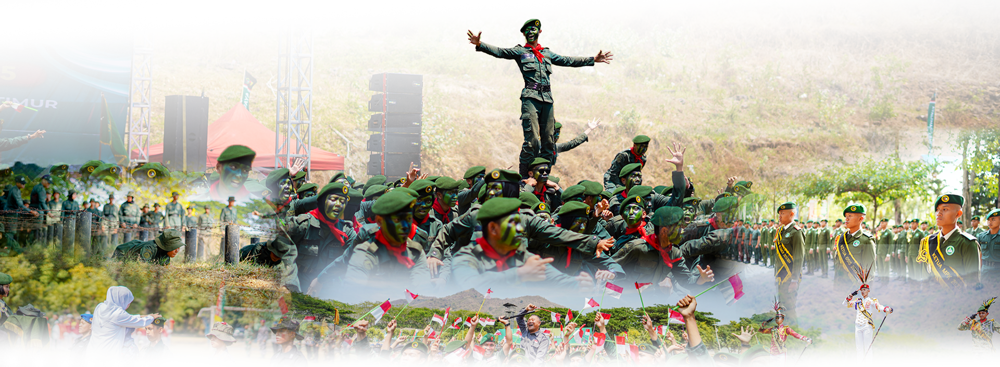

# 🏫 SMAN 5 Taruna Brawijaya Jawa Timur

🌐 **Website Resmi**: [https://smatarunakediri.sch.id/](https://smatarunakediri.sch.id/)



Redesign Website Sekolah SMAN 5 Taruna Brawijaya Jawa Timur — Sekolah berasrama berbasis kedisiplinan dan keunggulan akademik hasil kerja sama Pemerintah Provinsi Jawa Timur dengan Kodam V/Brawijaya.

---

## 🌟 Fitur Utama

- 🎨 **Desain Modern & Premium**: Mengusung skema warna _Dark Green_ (`#042f1d`) dengan aksen emas/gold (`#eab308` & `#d4af37`), tampilan bersih berbasis kartu, dan transisi gelombang vektor SVG responsif.
- 📱 **100% Fully Responsive**: Optimal diakses dari berbagai ukuran layar (Dekstop, Tablet, dan Smartphone).
- 🔗 **Multi-Page Architecture**: 8 Halaman HTML mandiri terinterkoneksi dengan navigasi aktif dan footer kaya informasi (_Rich Footer_).
- ⚡ **Ringan & Cepat**: Dibangun menggunakan Vanilla HTML5, Tailwind CSS CDN, dan SVG vektor murni tanpa _dependency_ berat.

---

## 📁 Struktur Berkas Proyek

```text
website smatajaya/
├── assets/                         # Folder Aset Visual & Media
│   ├── Smata-Jaya-Foto-Utama-2.png # Foto Utama Hero Section
│   ├── banner.png                  # Background Banner Hero Overlay
│   ├── logo tiga.png               # Logo Resmi (Jatim, SMAN 5, Brawijaya)
│   ├── header.svg                  # SVG Vektor Background Navbar Header
│   └── bottom-header.svg           # SVG Vektor Wave Separator Hero-Content
├── index.html                      # Halaman Utama / Beranda
├── profil.html                     # Halaman Profil, Sejarah, Visi & Misi
├── akademik.html                   # Halaman Kurikulum & Program Unggulan
├── taruna.html                     # Halaman Kehidupan Berasrama & Pengasuhan
├── informasi.html                  # Halaman Pusat Berita & Pengumuman
├── galeri.html                     # Halaman Galeri Foto Kegiatan
├── kontak.html                     # Halaman Kontak Sekretariat & Form Pesan
├── ppdb.html                       # Halaman Penerimaan Peserta Didik Baru (PPDB)
└── README.md                       # Dokumentasi Proyek
```

---

## 🗺️ Halaman Navigasi

| Halaman              | Berkas                             | Deskripsi                                                                                                |
| -------------------- | ---------------------------------- | -------------------------------------------------------------------------------------------------------- |
| **Beranda**          | [`index.html`](index.html)         | Landing page utama dengan Hero Banner, Fitur Nilai Utama, Berita Terbaru, Statistik, dan Galeri Ringkas. |
| **Profil**           | [`profil.html`](profil.html)       | Sejarah pendirian sekolah sinergi Pemprov Jatim & Kodam V/Brawijaya, Visi, Misi, serta Fasilitas.        |
| **Akademik**         | [`akademik.html`](akademik.html)   | Informasi Kurikulum Merdeka Plus, Pembinaan UTBK PTN & Kedinasan, serta Bahasa Asing.                    |
| **Taruna Brawijaya** | [`taruna.html`](taruna.html)       | Kehidupan berasrama (_boarding school_), jadwal rutinitas harian taruna, & pembinaan karakter.           |
| **Informasi**        | [`informasi.html`](informasi.html) | Pengumuman resmi, agenda kegiatan sekolah, dan siaran pers.                                              |
| **Galeri**           | [`galeri.html`](galeri.html)       | Dokumentasi foto-foto kegiatan, apel kedisiplinan, & prestasi taruna.                                    |
| **Kontak**           | [`kontak.html`](kontak.html)       | Informasi alamat sekretariat, nomor telepon, email, & formulir kontak interaktif.                        |
| **PPDB**             | [`ppdb.html`](ppdb.html)           | Informasi Penerimaan Peserta Didik Baru T.A. 2025/2026, alur pendaftaran, & unduh brosur.                |

---

## 🚀 Cara Menjalankan Proyek

1. **Clone Repository**:

   ```bash
   git clone https://github.com/aliefadityanugraha/smatajaya.git
   cd smatajaya
   ```

2. **Jalankan Secara Lokal**:
   - Buka berkas `index.html` secara langsung di peramban web (_browser_) favorit Anda.
   - Atau gunakan ekstensi **VS Code Live Server** (`http://localhost:5500/`).

---

## 🛠️ Teknologi yang Digunakan

- **Core**: HTML5 (Semantic Elements)
- **Styling**: Tailwind CSS (via CDN with Custom Theme Extension)
- **Icons & Graphics**: SVG Vector Graphics & Heroicons
- **Typography**: Google Fonts (_Inter_)

---

## 📜 Lisensi & Pengembang

Dikembangkan untuk **SMAN 5 Taruna Brawijaya Jawa Timur**.
_© 2024–2025 SMAN 5 Taruna Brawijaya Jawa Timur. All Rights Reserved._
